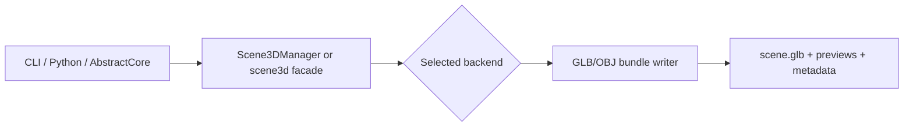
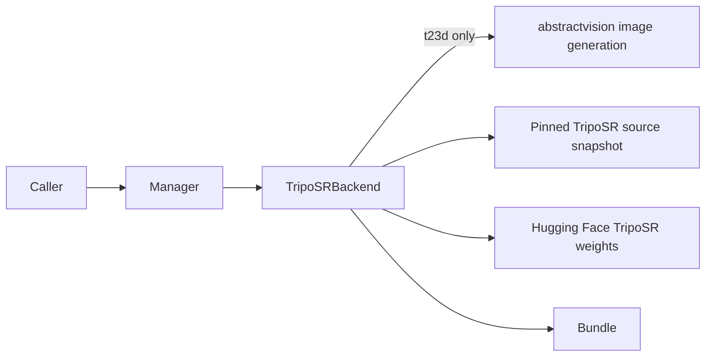
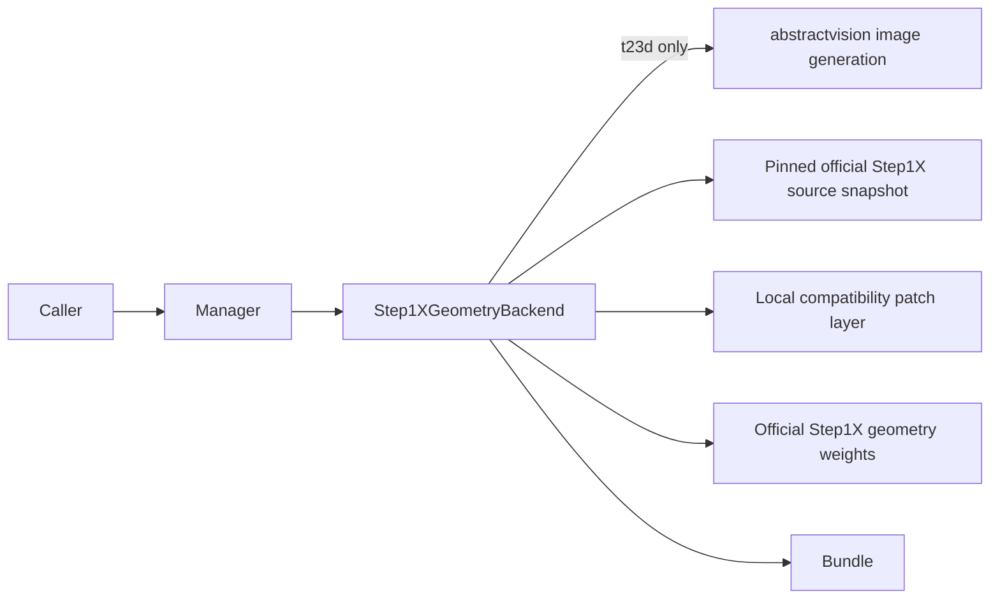

# Architecture

## Runtime Shape

All supported paths enter through the same public surface:

The validated default backend path is TripoSR:

The experimental Step1X path is geometry-only:

## Main Components

### `Scene3DManager`

Thin public manager that exposes:

- provider and model discovery
- backend selection by `backend_id`
- residency helpers
- `t23d`
- `i23d`
- `generate`
- `validate_suite`

### `TripoSRBackend`

Owns the validated backend behavior:

- resolves the pinned upstream TripoSR source snapshot
- normalizes legacy checkpoint keys for `transformers` v5
- uses an MPS-friendly marching-cubes fallback
- composes `t23d` through `abstractvision` without hardcoding a provider
- exports `glb`, `obj`, or zipped bundles

### `Step1XGeometryBackend`

Owns the experimental official Step1X geometry behavior:

- resolves a pinned official `stepfun-ai/Step1X-3D` source snapshot
- accepts only the official geometry checkpoint family
- keeps `t23d` explicit as `text -> image -> geometry`
- applies a small local compatibility patch layer so the pinned source works on the checked Apple-local Python and `transformers` stack
- defaults to `float32` on Apple `mps` for stability
- exports `glb`, `obj`, or zipped bundles

## Composed Image Boundary

`abstract3d` owns only the generic `t23d` composition contract:

- optional `image_provider`
- optional `image_model`
- `image_width`
- `image_height`
- `image_seed`

Resolution order is:

- explicit request values
- `scene3d_image_*` config keys
- `ABSTRACT3D_IMAGE_*` environment variables
- configured `abstractvision` defaults

Provider-specific controls such as LoRAs, scheduler details, or Apple-only runtime tuning remain owned by `abstractvision`, not `abstract3d`.

The package boundary is intentionally narrow:

- `abstract3d` base install includes lightweight `abstractvision`
- `abstractvision` owns remote OpenAI / OpenAI-compatible image generation and local image-engine selection
- `abstract3d[apple]` and `abstract3d[gpu]` add the local image and 3D runtime stacks needed for fully local composed `t23d`

### `Hunyuan3DShapeBackend`

- backend id `abstract3d:hunyuan3d21-local`, aliases `hunyuan3d21`, `hunyuan3d`, `hunyuan`
- wraps the official `tencent/Hunyuan3D-2.1` shape stage (flow-matching DiT plus shape VAE) from a pinned source snapshot
- also serves the official multi-view checkpoint `tencent/Hunyuan3D-2mv` (2.0 family) through the same pinned source: the checkpoint config targets the 2.0 namespace, so the loader rewrites `hy3dgen.shapegen.*` to the vendored `hy3dshape.*` (every referenced class exists 1:1; verified key-exact against the checkpoint at load)
- multi-view conditioning: reference views whose declared angles snap to the trained `front`/`left`/`back`/`right` slots (25° tolerance) are passed to the pipeline as the conditioning image dictionary, so extra photos constrain the geometry itself; the metadata records `multiview_conditioning` and `geometry_views`
- refuses to download or run weights until the operator acknowledges the territory-restricted Tencent Hunyuan Community License (both repositories ship under the same license family)
- replaces the upstream hierarchical volume decoder with an adaptive coarse-to-fine decoder (exact-doubling level schedule, host-side index bookkeeping, accelerator-side queries)
- textures assets through the shared projection bake in `texturing.py`; the official CUDA-only PaintPBR stage is out of scope

### `texturing.py`

- backend-agnostic UV texture bake shared by TripoSR and Hunyuan3D-2.1
- two projection models (ADR 0007): `perspective` (TripoSR-style pinhole with silhouette pose estimation and registration) and `orthographic` (canonical-frame mode for backends that reconstruct from a deterministically recentered conditioning image — the bake replicates that recenter per view and projects with the exact matching half-extent, so source registration is deterministic)
- visibility is a strict per-photo-pixel first-surface z-buffer built from the projected texels themselves (every surface texel occludes regardless of facing or photo alpha; 3x3 conservative widening; epsilon 0.25% of the surface diagonal) — no GL depth-map dependence, no orientation sector heuristics
- pipeline: xatlas unwrap, position/normal atlas rasterization (GPU with CPU fallback), per-view registration (crop-aware symmetric edge-chamfer for arbitrary photo crops; canonical recenter for ortho sources), contour alpha erosion, overlap-based color harmonization with revert-on-confound, a reprojection-error QA gate against the union of accepted views, per-texel conflict resolution with source priority on well-faced surface, mesh-surface outlier rejection (iterative two-hop graph consensus), seam-feathered best-view-biased blending, geometry-verified mirror completion, crease-aware mesh-graph harmonic fill for unseen texels (normal-weighted 3D inverse-distance fallback), edge bleed
- view angles are interpreted relative to the source viewpoint; backends can contribute a color-field prior for texels no view observed (TripoSR passes its triplane query)

### `segmentation.py`

- robust subject matting used by the Hunyuan backend for sources and references
- prefers the `isnet-general-use` checkpoint (the default u2net amputates low-contrast subject regions such as dark hair on light backgrounds) with graceful fallback
- `clean_alpha_mask` keeps dominant components and closes pinholes before the alpha drives framing, registration, or projection

### `Trellis2LocalBackend`

Owns the experimental official-only TRELLIS.2 path:

- resolves a pinned official `microsoft/TRELLIS.2` source snapshot
- accepts only official checkpoint families and official companion assets
- remains outside the permissive validated path because the official companion stack still requires a gated non-permissive dependency

### `model_catalog.py`

Tracks:

- the validated default backend
- experimental local backends
- blocked or research-only candidates that matter strategically but are not promoted to the validated path

## Artifact Contract

The primary artifact is `glb`.

Secondary artifacts:

- `obj`
- preview renders
- source input image
- `metadata.json`
- per-case `contact_sheet.png`

This contract stays object-centric and bundle-friendly so `abstractcore` hosts can treat 3D outputs the same way they already treat image, video, voice, and music outputs.

## Non-Goals

- large multi-object scene generation
- arbitrary room reconstruction
- silent fallback to remote 3D services
- silently widening the supported Step1X scope from geometry-only to textured/full-stack

## Durable Policy

The design boundaries for this repository are governed by:

- [ADR 0001](adr/0001_scene3d_local_first_glb_contract.md)
- [ADR 0002](adr/0002_validated_backend_uses_pinned_triposr_and_composed_t23d.md)
- [ADR 0003](adr/0003_trellis2_uses_official_upstream_assets_only.md)
- [ADR 0004](adr/0004_step1x_geometry_only_official_backend_with_local_compatibility_patches.md)

See [Model strategy](models.md) for why TripoSR remains validated by default and Step1X remains experimental.
