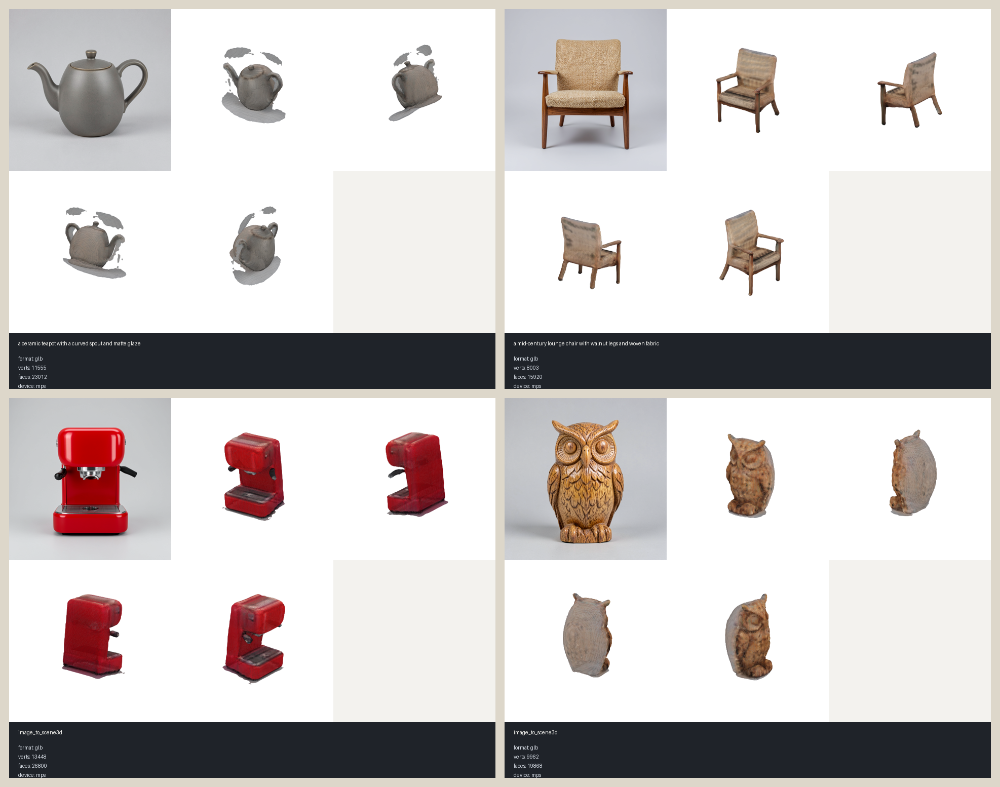
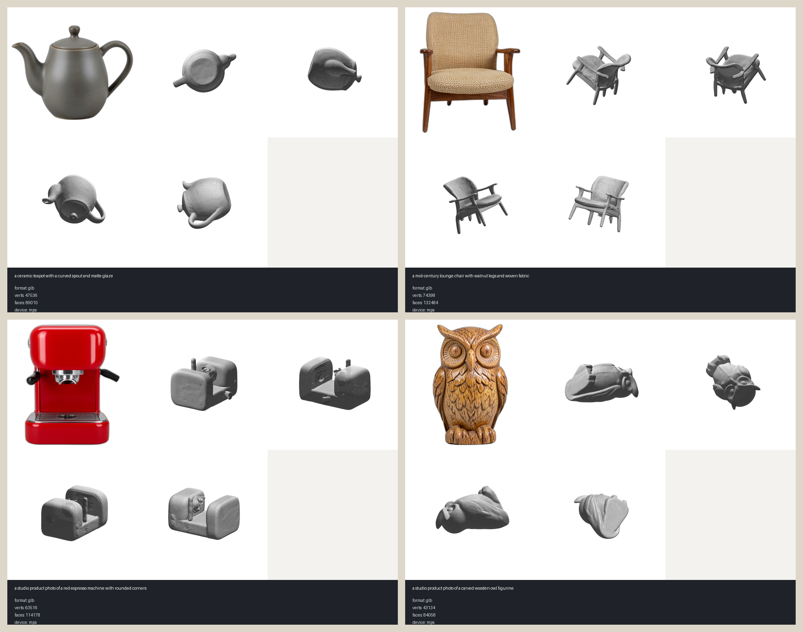
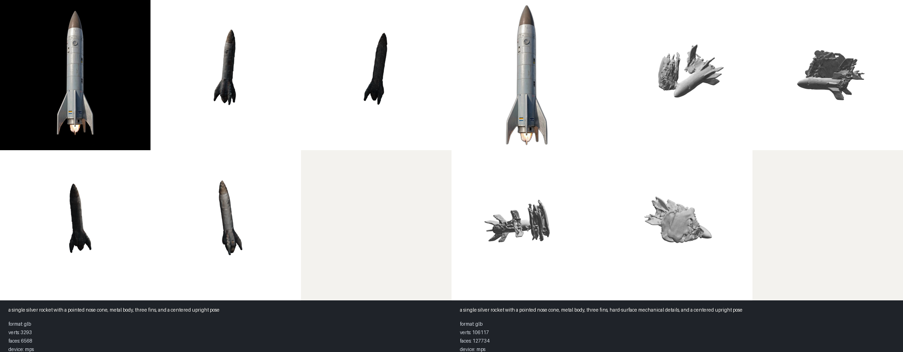
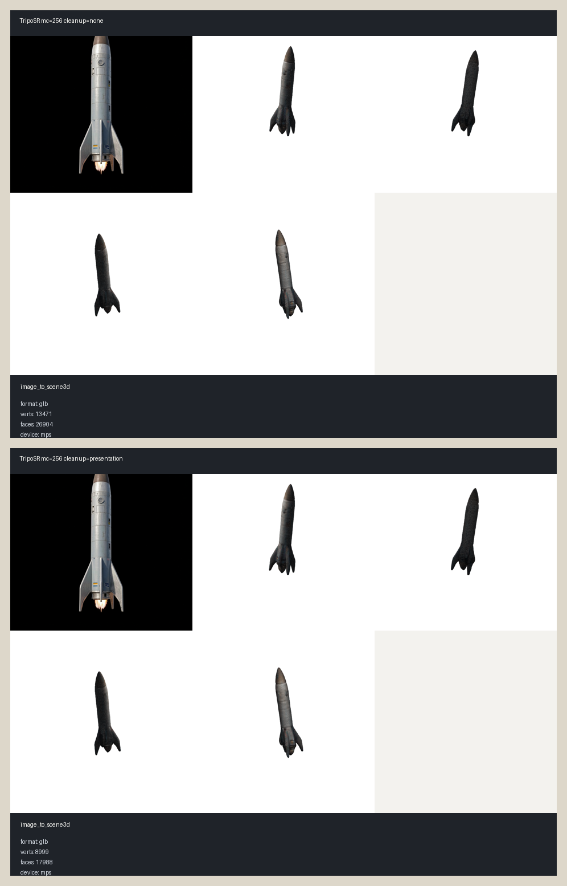
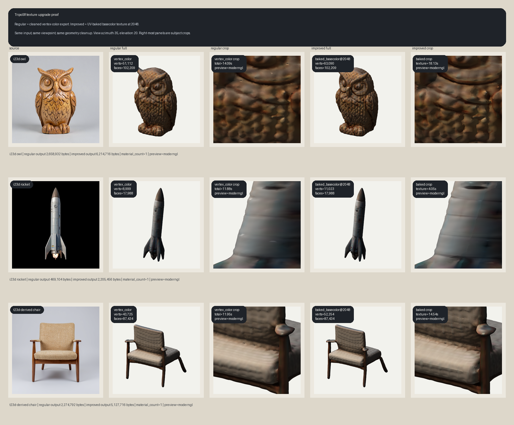
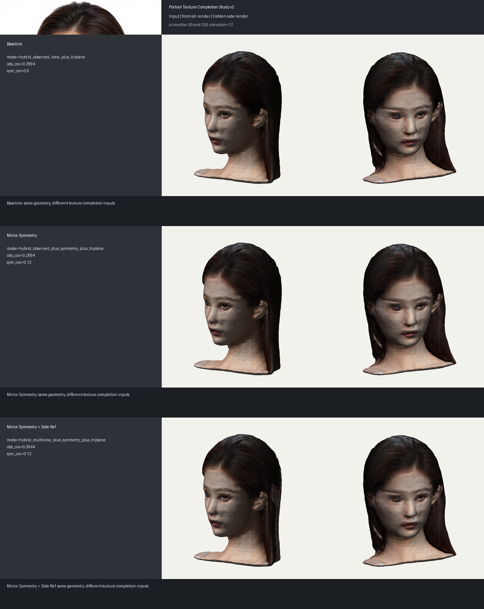
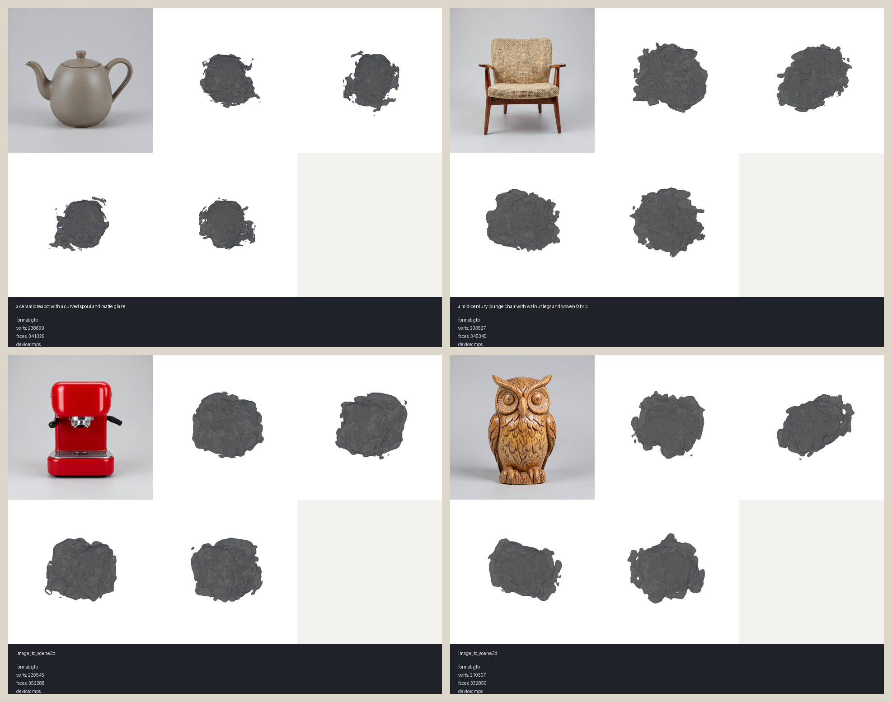
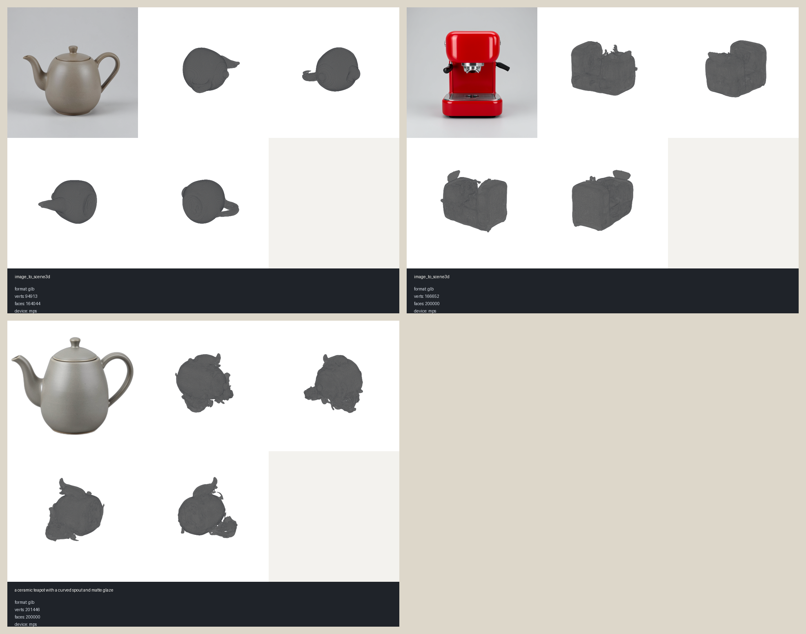
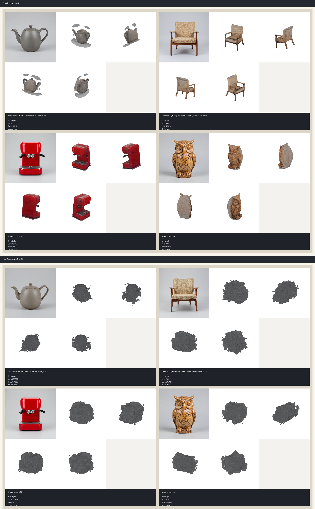

# Benchmarks And Validation

This repository includes checked local validation runs for the historical TripoSR full-suite baseline, the current focused TripoSR texture proof, the experimental Step1X geometry path, and the license-gated Hunyuan3D-2.1 shape backend.

See [Methodology](methodology.md) for the command patterns, Apple-local operating profile, and review criteria used to interpret these assets.

## Current Four-Object Cross-Backend Proof (2026-07-04)

The current proof matrix runs both shipped textured backends on four checked objects (composed
`t23d` owl and chair through `mlx-gen`, direct `i23d` starship and portrait) on Apple `mps`:

- lane: `artifacts/validation/final-proof/` (`{triposr,hunyuan}-{owl,chair,starship,face}`)
- combined sheet: `artifacts/validation/final-proof/summary/comparison_sheet.png`
- per-case metrics: `artifacts/validation/final-proof/summary/summary.json`
- versioned subset: the certified `hunyuan-starship` and `hunyuan-owl` bundles plus the
  summary sheet/metrics; the remaining six bundles stay in the local validation archive

Reading on the checked cases:

- TripoSR remains the fast validated default: roughly 20-60 s per object end to end, except
  the portrait mirror-symmetry case at about 4 minutes, which is dominated by the texture
  registration and bake stages rather than reconstruction.
- Hunyuan3D-2.1 produces materially stronger geometry on every checked object (watertight
  single-body meshes, preserved thin structures such as chair legs and hull antennae) at
  roughly 7-13 minutes per object at 30 steps.
- Textured output for both backends flows through the shared projection bake; hidden-surface
  color is exact where a view observed the surface and filled by mesh-graph harmonic
  diffusion elsewhere.

## Zero-Defect Certification (2026-07-07, cycles 1-6)

The full adversarial program (six cycles, alternating solver waves and two independent
verdict agents) closed with a PASS certification on all three proof assets:

- Defect ledger: 23 FIXED / 10 PROVEN-LIMIT (each with its documented capture remedy) /
  0 OPEN. Authority document: `artifacts/validation/texture-cycle-proofs/CERTIFICATION.md`.
- Face (`iter3-multiview-fixed/face-2mv`): compensated identity 0.704/14.9 against the
  ceiling-anchored 0.70/15.0 gate, compensated 28-view battery 0 failures, raw detectors
  green, texture_qa 13/13, four independent bakes sharing one texture hash.
- Starship and owl (`final-proof/`): texture_qa 13/13 each, byte-frozen to their
  certified hashes.
- Historical trajectory of the face on the same hostile harness: 66 failed checks at the
  program's start, 1 raw-gate failure after cycle 5 (the raw identity constant was
  retired only after a joint ceiling proof at the verdict agent's evidence standard),
  0 compensated failures at certification.

## Multi-View Face Proof (2026-07-05, second adversarial cycle)

The multi-view lane reruns the portrait with the `tencent/Hunyuan3D-2mv` checkpoint plus
left/right profile references. An earlier version of this section reported the
ADR 0007-era bundle as "coherent at all azimuths" with coverage 0.91; a hostile audit
demolished both claims (the bundle showed doubled features at three-quarter views, and
the coverage number counted mirror-fill as observation). The current numbers come from
the six-agent cycle behind ADR 0008 and are measured by an adversarial QA harness
(20 views x 5 defect detectors + pose-aware identity gates, calibrated so the reference
photos themselves pass):

- bundle: `artifacts/validation/iter3-multiview-fixed/face-2mv/`
- geometry conditioning: front + left + right
- QA harness failures: `66` (rejected ADR 0007-era bundle) -> `9-10`; doubled-feature,
  ghost-mouth, and skin-cascade classes now at zero; dark-debris view failures 22 -> 0
- front-photo identity SSIM at the photo's estimated pose: `0.516` -> `0.61-0.63`
- observed coverage reads `~0.40`: lower than the earlier 0.57-0.91 accounting because
  mixture bands are surrendered to fill and mirror sources are confidence-gated;
  the drop accompanies a large visual improvement (coverage is accounting, not quality)
- known residual limits (attributed, see ADR 0008): eye-region geometry renders the
  side photos' eyes as thin slivers (geometry, not texture); a pale tone band at the
  front/profile handoff (the photos genuinely differ in tone; needs band-limited local
  harmonization); the hairline renders clean but slightly hair-thinned because a baked
  opaque texture must commit each texel to one material where the photo shows
  semi-transparent wisps

## Generation Time and Mesh Density (2026-07-08)

Aggregated from every bundle `metadata.json` in the validation tree (87
checked runs, Apple M5 Max `mps` profile; regenerate the time/density
columns with `python scripts/generation_stats.py`). The two quality columns
are 1-5 visual-inspection scores (rubric and per-group evidence below):

| backend / task | n | total (median [min-max]) | vertices (median) | faces (median) | mesh quality | texture quality | model license |
| --- | --- | --- | --- | --- | --- | --- | --- |
| hunyuan3d21 / i23d | 9 | 766 s [481-2152] | 59,900 | 120,000 | 4.5 | 4.0 | Tencent Hunyuan Community (excludes EU/UK/KR) |
| hunyuan3d21 / t23d | 4 | 553 s [513-645] | 80,000 | 160,000 | 4.5 | 4.0 | Tencent Hunyuan Community (excludes EU/UK/KR) |
| step1x / i23d | 19 | 95 s [39-154] | 129,882 | 164,044 | 2.5 | n/a (geometry-only) | Apache-2.0 |
| step1x / t23d | 11 | 75 s [35-111] | 96,149 | 188,108 | 2.5 | n/a (geometry-only) | Apache-2.0 |
| triposr / i23d | 36 | 22 s [2-243] | 47,418 | 87,434 | 2.5 | 3.0 | MIT |
| triposr / t23d | 8 | 27 s [10-62] | 36,434 | 67,797 | 2.5 | 3.0 | MIT |

### How the quality scores are generated

The scores are qualitative judgments from a REPRODUCIBLE inspection
protocol, not a computed metric:

1. Two representative bundles per backend/task group (the canonical proof
   objects) are loaded through the MeshVault MCP server driven headless
   (`load_model`), inspected structurally (`describe_scene`), and rendered
   from three canonical angles (`screenshot` at azimuth 30/135/-90).
2. Every render, the combined review sheet, the structural data, and the
   per-group evidence notes are versioned under
   `artifacts/validation/quality-review/` (`scores.json` carries the
   rubric), so a reviewer can re-judge the same material independently.
3. Where a certified record exists (the Hunyuan proof assets), the score
   also cites it: texture 4.0 reflects `texture_qa` 13/13 with the
   documented proven-limit residuals, not perfection.

Scale: 5 production-ready at close inspection; 4 strong with minor
localized flaws; 3 recognizable and usable with visible flaws; 2 weak;
1 failed. Scores are per-group medians of the inspected subjects — e.g.
Step1X `i23d` pairs a recognizable espresso machine with a weak owl.

Reading the ranges honestly:

- `t23d` adds a composed image-generation stage (median 8-12 s through
  `mlx-gen` on this host) on top of the `i23d` path.
- TripoSR's 2 s minimum is the vertex-color fast path; the 243 s maximum is
  the portrait mirror-symmetry case, dominated by the texture bake — these
  historical numbers predate the bake performance program below, which cut
  the dominant bake stages (owl asset bake 258 s -> 88 s).
- Hunyuan totals are dominated by diffusion inference (median ~700 s at the
  30-50 step settings used in the proofs); Step1X is geometry-only (no
  texture stage).

### What controls time and density, and where it is exposed

| backend | density control (default) | time control (default) | Python kwarg | CLI flag |
| --- | --- | --- | --- | --- |
| triposr | `mc_resolution` (256); `cleanup` profile also reduces faces (raw->clean rocket: 26.9k -> 18.0k) | `mc_resolution`, `texture_mode`, `texture_resolution` (2048) | yes | `--mc-resolution`, `--cleanup`, `--texture-mode`, `--texture-resolution` |
| hunyuan3d21 | `octree_resolution` (384), `max_facenum` (120,000) | `num_inference_steps` (50; proofs used 30), `guidance_scale` (5.0) | yes | steps/guidance only — `--octree-resolution` / `--max-facenum` are **not** CLI-exposed yet |
| step1x | `octree_resolution` (128 on `mps`, 384 elsewhere), `max_facenum` (device-tuned) | `num_inference_steps` | yes | steps only — octree/facenum are **not** CLI-exposed yet |

All three backends also honor owner-config/env equivalents
(`scene3d_<backend>_octree_resolution`, `ABSTRACT3D_*`). The observed face
medians match the caps: Hunyuan meshes sit exactly at `max_facenum`
(120k/160k depending on run configuration), TripoSR at what `mc_resolution
256` plus cleanup yields (~87k). So density is controllable today from
Python and config; the CLI gap (octree/facenum flags) is tracked as a
known exposure defect — kwargs pass through `Scene3DManager.i23d(...)`
unvalidated, per the v0.2.0 review finding on silent kwargs.

## Bake Performance Program (2026-07-08, outputs bit-identical)

The certified texture pipeline was profiled stage-by-stage and optimized
under a hard constraint: every change must reproduce the certified texture
hashes bit-exactly. The golden-bake harness (`scripts/golden_bake.py`)
enforces this executably — it rebakes the three certified assets through
their canonical recipes and fails on any hash deviation.

Results on the golden recipes at res 2048 (Apple M5 Max, one process per
asset):

| asset | bake before | bake after | speedup | texture hash |
| --- | --- | --- | --- | --- |
| owl (single view) | 257.8 s | 88 s | 2.9x | `ff746509...` reproduced |
| face (multi-view) | 220.5 s | 167 s | 1.3x | `2baf7408...` reproduced |
| starship (single view) | 58.6 s | 55 s | 1.1x | `b8e2b0d4...` reproduced |

- proof pack: `artifacts/validation/bake-performance-program/` (before/after
  chart, per-asset pixel-identity sheets with |diff| panels, timeline plots,
  `report.json` with stage-level attribution)
- dominant fixes: pruned+parallel exact-NN mirror-twin lookup (167 s -> 1.1 s
  on the owl's mirror stage), thread-load-balanced donor queries, bounding-
  window per-blob commits (43 s -> 0.8 s on the face's pale-chip pass)
- memory: RSS peaks moved -0.15 GB (ship/owl); the peak is a plateau built
  across projection/blend/fill rather than one stage's spike (see the
  timeline plots), so further reduction needs lifetime work across stages
- honest scope: mesh inference (the 7-13 min Hunyuan stage) is untouched;
  these gains apply to the texture stage of every `i23d`/`t23d` textured
  generation and to `abstract3d.bundle.rebake_bundle`
- viewer verification ran two ways: the MeshVault app
  (`meshvault_rebaked_owl.png`) and the MeshVault MCP server driven
  headless over stdio JSON-RPC — `load_model` + `screenshot` on the
  rebaked GLB, no browser session
  (`meshvault_mcp_headless_owl.png`; server v1.28.1 also exposes
  `describe_scene`, `compare_models`, and the full viewer command API,
  which is the natural substrate for agent-driven generate -> inspect ->
  critique loops)

## Generated Reference Completion — Productized (2026-07-09, hardened 2026-07-10, root-caused 2026-07-11)

Round 3 (2026-07-11, four parallel adversarial audits on the owl):
geometry guides for the i2i conditioning now use HEADLIGHT shading (the
fixed world light had rendered every non-front guide at the Lambert clamp
floor — the generator invented interior features it was never shown);
reference registration requires mutual visibility plus a silhouette-
coverage guard (a far-side view had been fitted against front content
seen through the body, displacing every reference by up to 61 px); the
two-band fusion's low band carries projection weights; photo sovereignty
extends to the photo's full coverage edge; and the SH delight applies to
chain-constrained views. Final owl: whole-bake gate PASS (photo fidelity
deltaE 18.9 vs 19.5 ceiling), geometry-conformant back content at 87%
observed coverage. The mesh-forensics audit confirmed the owl mesh clean
and symmetric — all defects were pipeline-caused and fixed in code.

The manual generated-reference procedure below is now a first-class option:
`texture_reference_generation` (auto/on/off, default auto) on the Hunyuan
backend, `generate_references` on `abstract3d.bundle.rebake_bundle`, and
matching CLI flags. When only one photo is provided, the pipeline clay-renders
the reconstructed mesh from the target angles (back/left/right/top by
default; `texture_reference_generation_angles` accepts labels or
`label:azimuth,elevation` entries such as the starship's `bottom:0,-75`),
conditions a local i2i generation on a source-photo + clay composite,
gates every candidate on silhouette IoU >= 0.75 plus three STRICT
material-fidelity oracles (band-pass relief, part-palette identity, baked
speculars — floor-only candidates are reported, never baked), suppresses
baked specular highlights, applies cap-limited LAB tone matching, and
feeds accepted views into the certified bake as COMPLETION-ONLY witnesses:
generated weight is zero wherever the real photo holds a credible claim
(`protect_observed_texels`), so synthesis can only paint surface no photo
observed.

Two independent adversarial review rounds (2026-07-10) hardened the
shipping contract:

- **Whole-bake A/B acceptance**: when generated views enter a bake, the
  no-references baseline is baked too, and the generated bake ships only
  if it does not regress photo fidelity, front brightness, or long-seam
  metrics (`bake_acceptance.evaluate_generated_bake`). Calibrated on the
  labeled four-subject set: chair auto-rejects (upholstered near-planar
  subjects are the documented known-bad class — two usable views cannot
  texture them), owl / spaceship / portrait pass.
- **Person subjects are refused** in both `auto` and `on` (caption-based,
  fail-closed — an unavailable captioner refuses rather than proceeds);
  synthesis of a person requires the explicit person acknowledgment
  (`allow_person_subjects` / `texture_reference_allow_person`). Rationale:
  measured identity drift the material gates cannot see; no identity
  oracle exists yet.

Zero-hint validation (2026-07-10, four subjects, Klein-4B composite,
crash-isolated hands-off runs): owl 4/4 angles strict-pass (carved
plumage relief preserved, coverage 0.30 -> 0.81), spaceship 4/4,
portrait 4/4 ("on"+acknowledgment path only), chair 2/4 with the two
side-view rejections honest (material flips caught by the part gate).
Adversarial verdicts: spaceship SHIP, owl SHIP-WITH-CAVEATS (13
close-zoom dark fragments, all localized to the unwitnessed underside
band; product-level A/B worst per-view delta L -3.4 — no regression),
chair REJECT (auto-rejected by the acceptance gate at runtime), portrait
REJECT for unattended paths (refused by policy). Contact sheets and A/B
maps: `artifacts/validation/generated-references-v3/`.

Honest scope: a generated view is plausible synthesis, not ground truth.
Content on fully unobserved regions is invented from the mesh shape and
the source photo's materials; side views are generated independently.
Certified single-photo hashes stay bit-identical with the feature off
(golden gate) and `auto` cannot fire without an explicitly configured
LOCAL image provider. Every bundle records full provenance
(provider/model, prompts, seeds, per-attempt gate metrics, image hashes,
acceptance verdict) and persists the generated photos plus their clay
conditions as `generated_*.png`.

## Generated Reference Views (2026-07-08)

When a surface region is unobservable from the supplied photos, the pipeline can now
synthesize the missing view instead of leaving reconstruction fill: render the certified
mesh from the target angle (a clay render locks the silhouette), condition an
`abstractvision` `i2i` generation on that render, gate acceptance on silhouette IoU
(>= 0.75), tone-match in LAB space to the source photo, then rebake with the generated
view as an additional reference.

- bundles: `artifacts/validation/generated-references/{face-4view,owl-2view,starship-2view}`
- generated photos and the review sheet: `artifacts/validation/generated-references/reference-photos/`
- all three rebakes pass the same 13/13 texture QA harness as the certified assets
- honest scope: generated views are plausible synthesis, not ground truth; they replace
  the mesh-graph fill's flat tone with coherent detail (hair for the face back, plumage
  for the owl back, paneling for the ship underside), and metadata marks them as generated

## Validation Profile

- Date: `2026-06-22`
- Hardware: `Apple M5 Max`, `128 GB` unified memory
- Python: `3.12.13`
- `torch`: `2.10.0`
- `transformers`: `5.9.0`
- `trimesh`: `4.12.2`
- Device: `mps`
- Checked Apple-local proof image provider for `t23d`: `mlx-gen`
- Checked Apple-local proof image model for `t23d`: `AbstractFramework/flux.2-klein-4b-8bit`
- Historical full-suite marching-cubes resolution: `128`
- Current validated texture profile: `mc_resolution=256`, `cleanup=presentation`, `texture_mode=baked_basecolor`, `texture_resolution=2048`

Historical Step1X baseline settings preserved in this repo:

- backend id: `abstract3d:step1x-local`
- official model revision: `bf7084495b3a72222f36549b7942948aa4d9daa7`
- pinned source snapshot: `cb5ac944709c6c913109070c7b90c3447f57f3d4`
- local dtype on `mps`: `float32`
- `num_inference_steps`: `4`

That historical baseline is intentionally kept because it documents the rejected blob-like proof that triggered the Apple-local recovery work.

## Historical TripoSR Full-Suite Geometry Baseline



Historical baseline assets:

- [summary.md](assets/validation/local-triposr/summary.md)
- [summary.json](assets/validation/local-triposr/summary.json)
- [stats.json](assets/validation/local-triposr/stats.json)

Use this lane as the older geometry-focused baseline only. The checked textured TripoSR proof for the shipped default lives in [Focused TripoSR Texture Proof](#focused-triposr-texture-proof).

## Current Step1X Apple-Local Reference Lane

The current Step1X Apple-local reference lane is the dynamic-checkpoint suite under `local-step1x-dynamic/`. It reflects the actual runtime now shipped by `abstract3d` on Apple `mps`:

- official checkpoints: `Step1X-3D-Geometry-Label-1300m` by default, with automatic `Step1X-3D-Geometry-1300m` fallback for sharp asymmetric `i23d` cases
- `float32` on `mps`
- isolated CPU-side mesh helper after MPS denoising
- deterministic cleanup, vertex welding, and canonical export axes
- per-case subprocess isolation with an Apple-local RSS guard



Current Step1X assets:

- [summary.md](assets/validation/local-step1x-dynamic/summary.md)
- [summary.json](assets/validation/local-step1x-dynamic/summary.json)
- [stats.json](assets/validation/local-step1x-dynamic/stats.json)

Current visual take:

- teapot: recognizable and materially cleaner than the old blob baseline
- chair: materially better than the old blob baseline, but still below production bar
- espresso: materially better on the automatic base-checkpoint fallback, but still too boxy for promotion
- owl: still below production quality

Checkpoint comparison proof for the espresso case:

- [comparison contact sheet](assets/validation/step1x-espresso-checkpoint-comparison/contact_sheet.png)
- [comparison notes](assets/validation/step1x-espresso-checkpoint-comparison/summary.md)

## Focused Rocket `i23d` Comparison

The repository also includes a focused comparison for a single rocket input image across the two shipped local `i23d` backends.



Rocket comparison assets:

- [summary.md](assets/validation/rocket-i23d-comparison/summary.md)
- [summary.json](assets/validation/rocket-i23d-comparison/summary.json)
- [TripoSR contact sheet](assets/validation/rocket-i23d-comparison/triposr_contact_sheet.png)
- [Step1X contact sheet](assets/validation/rocket-i23d-comparison/step1x_contact_sheet.png)

Focused result:

- TripoSR produced the cleaner and more recognizable rocket silhouette on this input.
- Step1X completed only on the stable Apple-local label-geometry profile for this image.
- Stronger Step1X probes on this rocket input exceeded the checked Apple `mps` cap on this machine.

## Focused TripoSR Raw-vs-Clean Rocket Proof

The repository also includes a focused proof for the current TripoSR cleanup pass on the same rocket image. Both rows use `mc_resolution=256`; the only difference is whether the backend cleanup is disabled or enabled.



Cleanup comparison assets:

- [summary.md](assets/validation/triposr-rocket-cleanup/summary.md)
- [summary.json](assets/validation/triposr-rocket-cleanup/summary.json)
- the full raw/clean bundles remain in the local (unversioned) validation archive

Focused cleanup result:

- raw `mc=256`: `13,471` verts / `26,904` faces / topology `body_count=1`, `euler=-15`
- cleaned `mc=256`: `8,999` verts / `17,988` faces / topology `body_count=1`, `euler=-4`
- the cleanup pass improves the extracted surface and topology enough to be worth shipping, but it does not turn TripoSR into a CAD-like hard-surface model

## Focused TripoSR Texture Proof

The repository now also includes a focused proof for the validated textured TripoSR path. It compares the lighter cleaned vertex-color export against the baked `2048` UV texture path on two direct `i23d` objects and one `t23d`-derived object source.



Texture proof assets:

- [summary.md](assets/validation/triposr-texture-proof/summary.md)
- [summary.json](assets/validation/triposr-texture-proof/summary.json)

Focused texture takeaways:

- the validated TripoSR lane now defaults to baked `2048` base-color textures
- the baked path produces materially larger bundles and adds a distinct texture stage cost
- on the checked owl, rocket, and chair proof objects, the visual gain is real but modest; it is strongest in downstream UV-textured asset compatibility and in subtle material detail, not in dramatic geometry changes
- an explicit `4096` texture run on the chair proof object increased runtime and file size, but it did not improve quality enough to justify promoting it over `2048`

## Focused TripoSR Portrait Texture Completion Proof

The repository also includes a focused portrait proof for single-view hidden-side texture completion. It compares:

- baseline baked TripoSR texture
- baked TripoSR texture plus `mirror_symmetry`
- baked TripoSR texture plus `mirror_symmetry` and one auxiliary `side_left` texture reference



Portrait proof assets:

- [summary.md](assets/validation/triposr-portrait-texture-proof/summary.md)
- [summary.json](assets/validation/triposr-portrait-texture-proof/summary.json)

Focused portrait takeaways:

- `mirror_symmetry` is the safest improvement for single front-view symmetric subjects because it fills some uncovered front-side texels from the visible half without repainting the whole atlas
- one auxiliary side reference increases observed texture coverage more than symmetry alone, but on the checked portrait case the remaining quality limit is still geometry
- TripoSR remains useful for modest portrait texture cleanup, not for portrait-specialized hidden-side facial reconstruction

## Historical Step1X Baseline



Historical baseline assets:

- [summary.md](assets/validation/local-step1x/summary.md)
- [summary.json](assets/validation/local-step1x/summary.json)
- [stats.json](assets/validation/local-step1x/stats.json)

Use this lane as the rejected historical baseline only. It is not the current Step1X reference profile.

## Step1X Recovery Diagnostics

The repository also preserves focused Apple-local Step1X recovery diagnostics. These are not promotion-grade proof assets; they are evidence of the runtime fixes and the remaining gap.



Recovery assets:

- [summary.md](assets/validation/step1x-recovery/summary.md)
- [summary.json](assets/validation/step1x-recovery/summary.json)
- [comparison_contact_sheet.png](assets/validation/step1x-recovery/comparison_contact_sheet.png)

Recovery interpretation:

- matched teapot and espresso `i23d` cases improved materially versus the original bad Step1X baseline
- the Apple-local Step1X runtime now uses automatic opaque-image background removal, lower default guidance on `mps`, deterministic CPU post-extraction cleanup, and MLX cache release before composed `t23d` geometry
- the broad four-case Apple-local suite is still below a production bar

## Historical Comparison Contact Sheet

The checked TripoSR-versus-Step1X comparison contact sheet below is historical baseline evidence. It compares TripoSR against the older rejected Step1X lane, not against the current `local-step1x-dynamic` reference run.



Historical comparison assets:

- [summary.md](assets/validation/comparison-step1x-vs-triposr/summary.md)
- [summary.json](assets/validation/comparison-step1x-vs-triposr/summary.json)

## Aggregate Comparison

Current checked aggregate comparison on the Apple-local profile:

| Metric | TripoSR | Current Step1X dynamic lane | Ratio |
|---|---:|---:|---:|
| Average total time per case | `6.3624 s` | `101.8601 s` | `16.0118x` |
| Average inference time | `0.4029 s` | `55.1116 s` | `136.7858x` |
| Average composed `t23d` image time | `7.5063 s` | `4.1172 s` | `0.5485x` |
| Average MPS allocated | `1.5649 GiB` | `0.0008 GiB` | `0.0005x` |
| Average vertices | `10,742` | `57,146` | `5.3193x` |
| Average faces | `21,400` | `104,932.5` | `4.9034x` |

## TripoSR Aggregate Results

From the checked TripoSR validation run:

- Cases: `4`
- `t23d` cases: `2`
- `i23d` cases: `2`
- Average total time per case: `6.3624 s`
- Average preprocessing time: `0.0047 s`
- Average inference time: `0.4029 s`
- Average mesh extraction time: `2.2017 s`
- Average text-to-image composition time for `t23d`: `7.5063 s`
- Average process RSS after generation: `17.9945 GiB`
- Average MPS allocated memory after generation: `1.5649 GiB`
- Average mesh size: `10,742` vertices and `21,400` faces

## Current Step1X Aggregate Results

From the current `local-step1x-dynamic` Apple-local reference run:

- Cases: `4`
- Successful cases: `4`
- Failed cases: `0`
- Average total time per case: `101.8601 s`
- Average inference time per case: `55.1116 s`
- Average mesh extraction time per case: `38.4166 s`
- Average preprocessing time per case: `6.2733 s`
- Average text-to-image composition time for `t23d` cases: `4.1172 s`
- Average parent-process RSS after generation: `3.2993 GiB`
- Average final MPS allocated after generation: `0.0008 GiB`
- Average mesh size per case: `57,146` vertices and `104,932.5` faces

## Per-Case Current Step1X Results

| Case | Mode | Status | Total s | Image s | Prep s | Infer s | Mesh s | Checkpoint | Vertices | Faces | RSS GiB |
|---|---:|---:|---:|---:|---:|---:|---:|---|---:|---:|---:|
| `01_t23d` | `t23d` | `succeeded` | `83.298` | `4.0509` | `5.8002` | `34.2857` | `39.1612` | `label` | `47,536` | `89,010` | `4.9253` |
| `02_t23d` | `t23d` | `succeeded` | `111.2721` | `4.1835` | `5.9208` | `59.2726` | `41.8952` | `label` | `74,398` | `132,484` | `4.9484` |
| `03_i23d` | `i23d` | `succeeded` | `121.4867` | `n/a` | `6.7083` | `74.6448` | `40.1336` | `base fallback` | `63,516` | `114,178` | `1.6578` |
| `04_i23d` | `i23d` | `succeeded` | `91.3835` | `n/a` | `6.6639` | `52.2431` | `32.4765` | `label` | `43,134` | `84,058` | `1.6658` |

## Storage Snapshot

Measured on the validation machine:

- TripoSR Hugging Face cache: `1.6G`
- pinned TripoSR source snapshot: `63M`
- Step1X geometry subset: `6.8G`
- pinned Step1X source snapshot: `147M`
- optional Apple-local proof image model cache (`AbstractFramework/flux.2-klein-4b-8bit` via `mlx-gen`): `8.0G`
- generated dynamic Step1X validation bundles: `53M`
- dynamic Step1X docs-ready proof assets: `785K`
- free disk after the current Step1X rerun: about `87 GiB`

## Interpretation

- TripoSR remains the validated default because it is much faster on the checked Apple-local profile and still produces more consistently recognizable shapes on the same four benchmark cases.
- Step1X geometry runs locally, produces reproducible bundles, and integrates cleanly with `abstractcore`, but it remains experimental.
- The current `local-step1x-dynamic` lane is materially better than the historical `local-step1x` baseline and now completes all four checked cases safely under guarded Apple-local execution.
- That improvement is still not enough to claim a broad production-grade Step1X Apple-local path. The chair remains below bar, the owl remains weak, and the espresso `i23d` case is still too boxy even after the base-checkpoint fallback.
- An official-like higher-quality chair stress run (`50` steps, guidance `7.5`, octree `384`) did not complete on this Apple `mps` lane, so upstream-like high-quality settings are not yet operationally safe here.

## Caveats

- Both `t23d` paths are composed. They measure `text -> image -> 3D`, not native text-only 3D generation.
- The Step1X Apple-local path uses `float32` on `mps` for stability.
- The current Step1X dynamic reference lane reports averages over all four successful cases.
- The Step1X Apple-local validator now guards each case with isolated subprocess execution and a default `64 GiB` RSS limit, because pathological cases can still climb far above the final post-run RSS numbers.
- The checked validation cases are intentionally object-centric. They are proof cases for the current contract, not a claim of broad scene reconstruction.
- TRELLIS.2 remains outside the permissive validated path because its official companion stack still requires the gated non-permissive DINOv3 dependency.

## Reproduce

```bash
python scripts/validate_local.py --backend triposr --device mps --mc-resolution 256
python scripts/validate_local.py --backend step1x --device mps --mc-resolution 128
```
